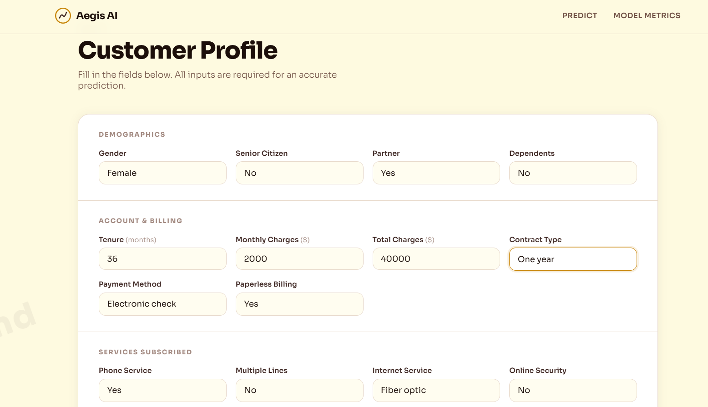
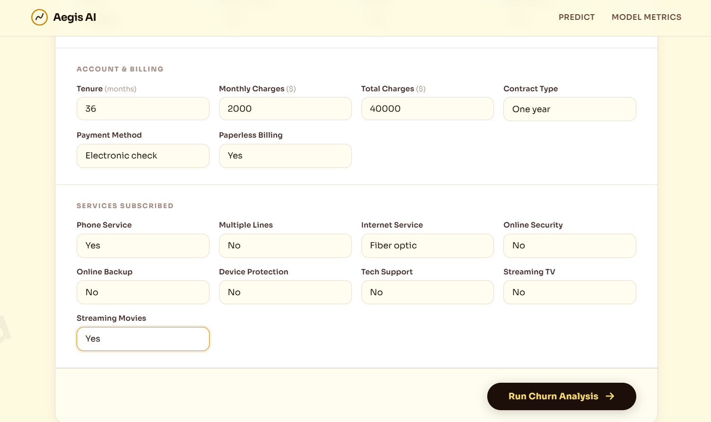
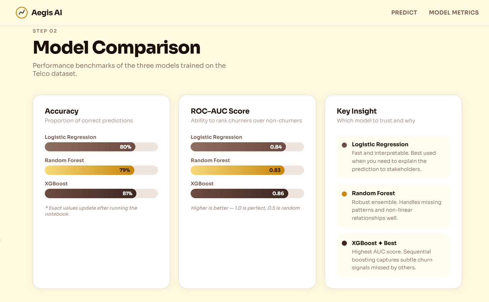
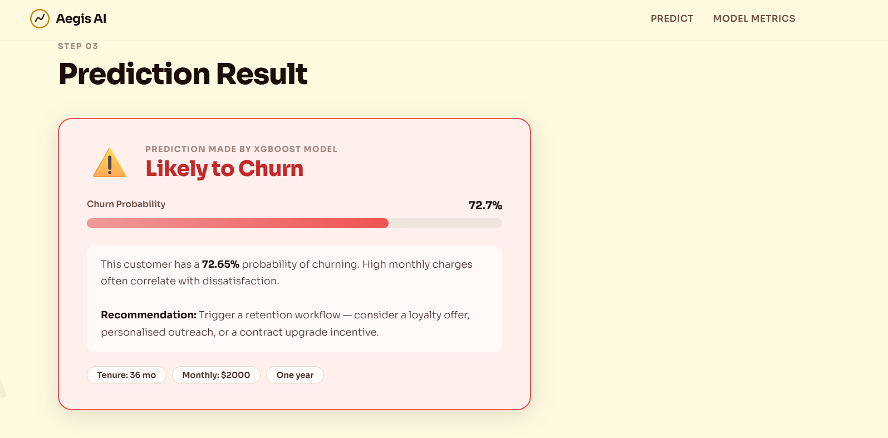

# AEGIS AI - CUSTOMER CHURN PREDICTION & ANALYSIS PLATFORM

Aegis AI is an end-to-end Machine Learning web application designed to predict customer churn with high precision. Built with a Flask-based web interface and an optimized Scikit-learn/XGBoost backend, the platform processes complex customer demographic and behavioral indicators in real-time to identify at-risk customers before they leave.

---

## 1. KEY FEATURES

- **Multi-Model Inference Framework:** Real-time evaluation using multiple optimized machine learning classifiers.
- **Interactive Web UI:** A clean, streamlined dashboard for inputting customer profiles and instantly receiving dynamic churn probability scores.
- **Robust Pipeline Integration:** Automated data preprocessing, standardization scaling, and categorical feature tracking embedded seamlessly into the app.
- **Production-Grade Architecture:** Structured and organized repository architecture optimized for rapid testing, scalability, and seamless deployment.

---

## 2. PERFORMANCE METRICS

- **Accuracy:** Overall proportion of correct classifications. Baseline operational reliability.
- **Precision:** Out of all predicted churn cases, how many were true churn. Minimizing false positives and operational cost waste.
- **ROC-AUC:** The model's capacity to distinguish between churning and loyal customers. High discriminatory confidence across all probability thresholds.

---

## 3. INTERFACE & VISUALS

### Customer Profile Interface



The user enters customer demographic, account, and service-related information required for churn prediction.

### Customer Profile Example



A completed customer profile demonstrating the feature inputs processed by the machine learning pipeline.

### Model Performance Comparison



Comparison of machine learning models evaluated during development to identify the best-performing churn prediction model.

### Churn Prediction Result



Final prediction output generated by the trained model, indicating whether a customer is likely to churn.

---

## 4. TECH STACK

- **Backend Logic & Core:** Python 3.x
- **Web Framework:** Flask
- **Machine Learning & Pipeline Backend:** Scikit-learn, XGBoost
- **Data Engineering & Analysis:** Pandas, NumPy
- **Frontend Presentation:** HTML5, Custom CSS3, JavaScript (ES6)

---

## 5. PROJECT STRUCTURE

```text
CUSTOM.../
│
├── data/                             # Raw and processed datasets
│   ├── images/                       # Documentation assets and screenshots
│   └── WA_Fn-UseC_-Telco-...         # Telco customer churn source dataset
│
├── model/                            # Serialized model artifacts and pipelines
│   ├── churn_model.pkl               # Trained production ML model
│   ├── feature_names.pkl             # Tracking index for aligned feature vectors
│   └── scaler.pkl                    # Fitted preprocessing standard scaler
│
├── notebooks/                        # Experimental analysis & research
│   └── churn_prediction.ipynb        # Exploratory Data Analysis (EDA) & training pipeline
│
├── static/                           # Client-side static assets
│   ├── css/                          # Stylesheets for UI presentation
│   └── js/                           # Interactive frontend scripts
│
├── templates/                        # Server-side UI templates
│   └── index.html                    # Core user layout and dashboard view
│
├── app.py                            # Flask application gateway and prediction API
├── requirements.txt                  # Python production application dependencies
└── runtime.txt                       # Platform runtime specification
```

---

## 6. CORE MACHINE LEARNING PIPELINE

Aegis AI implements a comparative testing suite across three primary archetypes to handle complex structural nuances in the data:

1. **Logistic Regression** – Serves as a baseline statistical benchmark.
2. **Random Forest** – An ensemble bagging approach used to prevent over-fitting.
3. **XGBoost (Extreme Gradient Boosting)** – A high-performance boosting paradigm optimized for capturing non-linear relationships.

During training, numerical features are isolated and transformed using the saved `scaler.pkl` to normalize variances, while categorical data points are mapped using `feature_names.pkl` to safeguard prediction consistency during API calls.

---

## 7. QUICK START & INSTALLATION

### Step 1: Replicate the Repository

```bash
git clone https://github.com/yourusername/aegis-ai.git
cd aegis-ai
```

### Step 2: Set Up Environment & Install Dependencies

It is highly recommended to isolate the workspace using a virtual environment:

```bash
# Create a virtual environment
python -m venv venv

# Activate the virtual environment

# On Windows
venv\Scripts\activate

# On macOS/Linux
source venv/bin/activate

# Install all locked package requirements
pip install -r requirements.txt
```

### Step 3: Initialize the Core Application

```bash
python app.py
```

Open your preferred web browser and navigate to:

```text
http://127.0.0.1:5000/
```

---

## 8. ROADMAP & FUTURE HORIZONS

- **Cloud Deployment Native:** Wrap the runtime container via Docker and configure auto-scaling deployment blocks on AWS/GCP.
- **Secure Identity & Access Management (IAM):** Build comprehensive RBAC (Role-Based Access Control) using Flask-Login and PostgreSQL.
- **Advanced Engineering Features:** Seamless ingestion of historical data lakes to establish recursive behavioral analysis patterns.
- **Explainable AI Integration (XAI):** Embed visual interpretations natively into the UI via SHAP or LIME charts to give users clear rationales for every risk flag.

---
